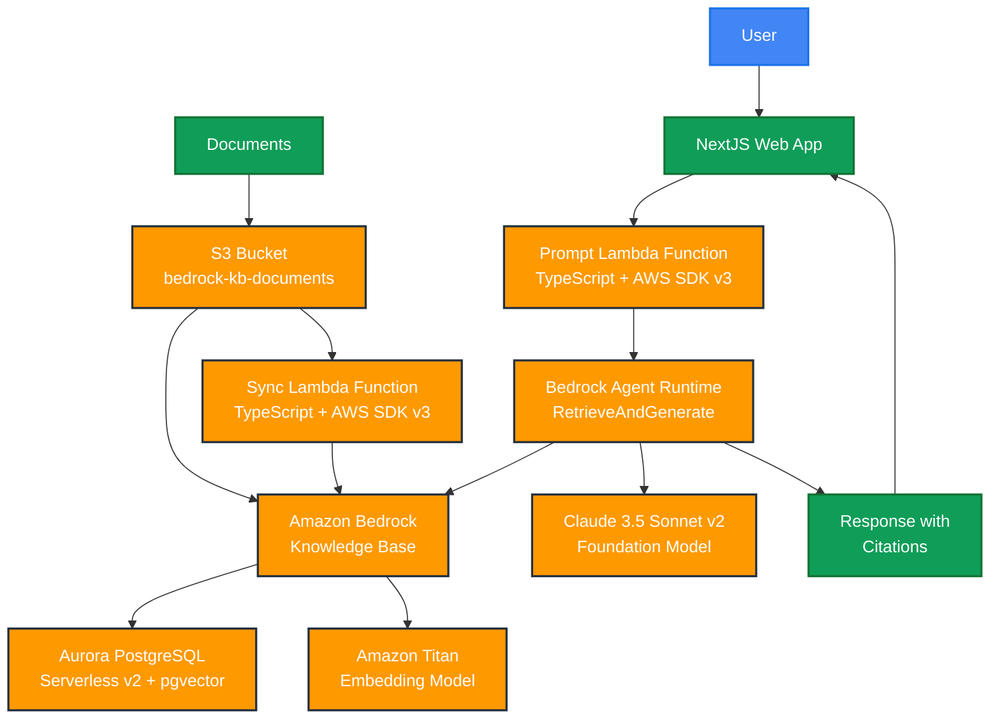

# Amazon Bedrock architecture with Knowledge Base and Lambda using SST

This is a proof of concept that uses Amazon Bedrock to create a chatbot.

It uses: 
- SST v3 to deploy everything to AWS
- Aurora PostgreSQL Serverless v2 with pgvector as vector database
- Lambda functions in TypeScript with AWS SDK v3
- NextJS for the web interface

## Architecture



## Get started

Setup your IAM credentials: [https://docs.sst.dev/advanced/iam-credentials](https://docs.sst.dev/advanced/iam-credentials)

Execute the following commands:

```bash
# Install dependencies
npm install

# For development (hot reload, local testing)
npm run dev

# For production deployment
npm run deploy

# Other useful commands:
# npm run build    - Build the project
# npm run remove   - Remove all AWS resources
# npm run console  - Open SST console
```

## Estimated Monthly Cost

**⚠️ Cost Warning:** This architecture uses Aurora PostgreSQL Serverless v2 which can be expensive for proof-of-concept usage.

**Estimated monthly costs (us-east-1):**
- **Aurora Serverless v2**: $43-86/month (0.5-1.0 ACU minimum + storage)
- **Lambda functions**: $1-5/month (depending on usage)
- **Bedrock API calls**: $3-20/month (depending on query volume)
- **S3 storage**: $1-3/month (document storage)

**Total estimated: $48-114/month**

For development/testing, consider:
1. Using `npm run remove` when not actively developing
2. Setting Aurora to minimum 0.5 ACU in the stack configuration
3. Using a smaller pgvector dimension size if possible
