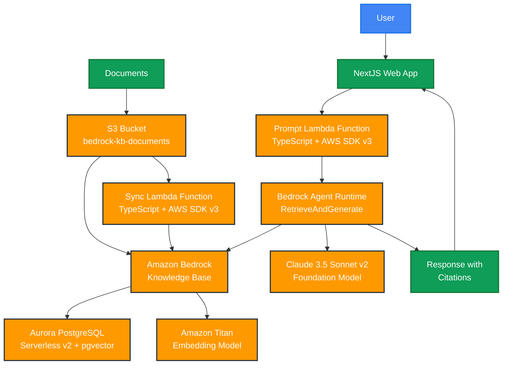

# Amazon Bedrock architecture with Knowledge Base and Lambda using SST

This is a proof of concept that uses Amazon Bedrock to create a chatbot.

It uses: 
- SST v3 to deploy everything to AWS
- Aurora PostgreSQL Serverless v2 with pgvector as vector database
- Lambda functions in TypeScript with AWS SDK v3
- NextJS for the web interface

## Architecture



## Get started

Setup your IAM credentials: [https://docs.sst.dev/advanced/iam-credentials](https://docs.sst.dev/advanced/iam-credentials)

Execute the following commands:

```
npm install
npm run deploy
```
